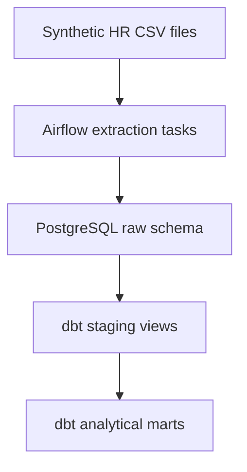

# Airflow + dbt ELT Data Platform

A portfolio-ready ELT framework for loading synthetic Human Resources data into PostgreSQL with Apache Airflow 3 and transforming it with dbt.

## Architecture



- Airflow orchestrates extraction, schema synchronization, loading, and dbt execution.
- PostgreSQL stores both Airflow metadata and the analytical data warehouse.
- YAML contracts define raw-table columns, data types, nullability, and indexes.
- dbt cleans and standardizes raw data in staging views and exposes business-ready mart tables.
- dbt model documentation and data tests are defined in the project alongside the transformations.
- Docker and Astronomer provide a reproducible local environment.

## Included data domains

| Dataset | Raw table | Staging model | Mart model |
|---|---|---|---|
| Employees | `raw.src_hr_employees` | `stg_hr_employees` | `dim_hr_employees` |
| Payroll | `raw.src_hr_payroll` | `stg_hr_payroll` | `fct_hr_payroll` |
| Performance reviews | `raw.src_hr_performance_reviews` | `stg_hr_performance_reviews` | `fct_hr_performance_reviews` |
| Departments | `raw.src_hr_departments` | `stg_hr_departments` | `dim_hr_departments` |
| Consulting firms | `raw.src_hr_consulting_firms` | `stg_hr_consulting_firms` | `dim_hr_consulting_firms` |

All included records are synthetic and intended exclusively for demonstration and testing.

## Project structure

```text
.
├── dags/                         # Airflow DAG definitions
├── dbt/                          # dbt project, sources, staging models, marts, tests, and docs
├── include/connections/postgres/ # PostgreSQL clients and load utilities
├── include/data/                 # Synthetic CSV source files
├── include/elt/                  # Extractors, pipeline contracts, and DAG factory
└── scripts/                      # One-off dataset maintenance utilities
```

## Requirements

- Docker
- Astronomer CLI

## Start the project

Create the local environment file:

```bash
cp example.env .env
```

Start Airflow and PostgreSQL:

```bash
astro dev start
```

Open the Airflow UI at <http://localhost:8080> and trigger the `elt_hr` DAG.

## Local ports

| Service | Address |
|---|---|
| Airflow API and UI | `localhost:8080` |
| Airflow metadata database | `localhost:5680` |
| PostgreSQL data warehouse | `localhost:5433` |

The sample environment configures the analytical database as `dw_hr` with the local-only credentials defined in `example.env`.

## Run dbt manually

Enter the Airflow container:

```bash
astro dev bash
```

Then run:

```bash
cd /usr/local/airflow/dbt
dbt debug --target dev
dbt run --target dev --select tag:hr
dbt test --target dev --select tag:hr
```

The mart layer is documented in `dbt/models/marts/schema.yml`. The project also contains a payroll reconciliation test that checks whether source gross pay matches the sum of its compensation components.

## Select pipelines at runtime

The DAG supports optional run configuration. For example, the following payload loads only employees and departments:

```json
{
  "include_pipelines": ["employees", "departments"],
  "mode": "full_refresh"
}
```

Use `exclude_pipelines` instead of `include_pipelines` to skip selected sources. The current framework intentionally supports only full-refresh loads.

## Data flow

For each enabled pipeline, Airflow:

1. Checks whether the pipeline is included in the current run.
2. Creates or synchronizes the target raw table from its YAML contract.
3. Reads the corresponding CSV source into a DataFrame.
4. Applies the YAML column and type contract.
5. Loads the data into PostgreSQL using truncate-and-insert semantics.
6. Runs the dbt models tagged `hr` after the raw loads finish.

The `.env` file is intentionally ignored by Git. Use `example.env` as the safe configuration template and never commit real credentials.
